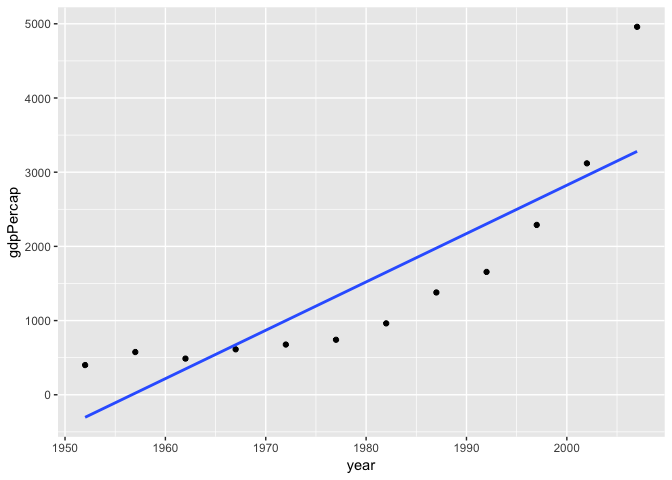
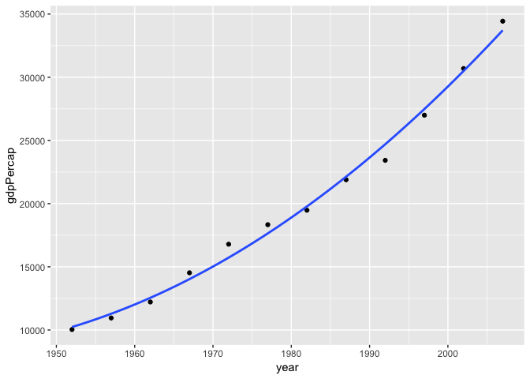
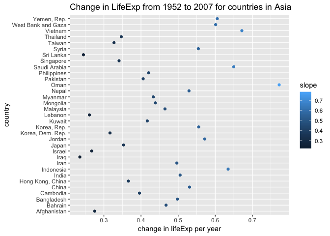
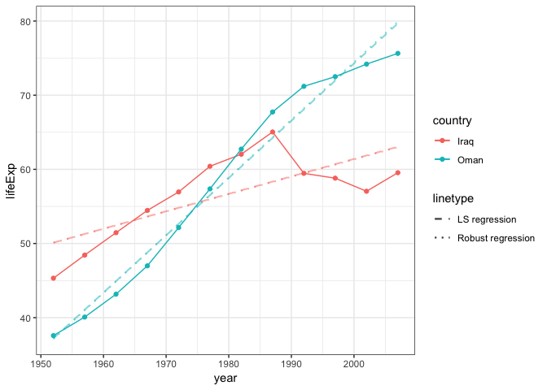

hw06-lh563
================
Lu Han
11/1/2018

Homework 06
===========

In this homework, we are required to complete two tasks out of six. In this case, task 2: working with functions and task 6: work with nested dataframe were selected in this assignment.

``` r
suppressPackageStartupMessages(library(gapminder))
suppressPackageStartupMessages(library(broom))
suppressPackageStartupMessages(library(MASS))
suppressPackageStartupMessages(library(dplyr))
suppressPackageStartupMessages(library(tidyverse))
```

Task 02
-------

### Working with functions

First, let's filter the data of China

``` r
(gap<- gapminder %>% 
  filter(country == "China"))
```

    ## # A tibble: 12 x 6
    ##    country continent  year lifeExp        pop gdpPercap
    ##    <fct>   <fct>     <int>   <dbl>      <int>     <dbl>
    ##  1 China   Asia       1952    44    556263527      400.
    ##  2 China   Asia       1957    50.5  637408000      576.
    ##  3 China   Asia       1962    44.5  665770000      488.
    ##  4 China   Asia       1967    58.4  754550000      613.
    ##  5 China   Asia       1972    63.1  862030000      677.
    ##  6 China   Asia       1977    64.0  943455000      741.
    ##  7 China   Asia       1982    65.5 1000281000      962.
    ##  8 China   Asia       1987    67.3 1084035000     1379.
    ##  9 China   Asia       1992    68.7 1164970000     1656.
    ## 10 China   Asia       1997    70.4 1230075000     2289.
    ## 11 China   Asia       2002    72.0 1280400000     3119.
    ## 12 China   Asia       2007    73.0 1318683096     4959.

Plot the data.

``` r
p <- ggplot(gap, aes(x = year, y = gdpPercap))
p + geom_point() + geom_smooth(method = "lm", se = FALSE)
```

 Fit the linear regression model

``` r
gap_lm <- lm(gdpPercap~year,data=gap)
coef(gap_lm)
```

    ##   (Intercept)          year 
    ## -127509.31555      65.16677

From the previous graph, we can tell the linear regression is not a good model for the data as most of the dots do not fall on the line. From the coefficient, we can tell that when year=0, gdpPercap=intercept=-127509.31555 , which does not make sense. Hence, a quadratic regression model is applied to fit the data.

``` r
gap_qm<- lm(gdpPercap~I(year)+I(year^2),data=gap)
coef(gap_qm)
```

    ##   (Intercept)       I(year)     I(year^2) 
    ## 8958302.83646   -9115.43742       2.31892

The intercept is too large when the year=0. Hence, according to Jenny's tutorial, an offset of 1952 was applied.

``` r
gap_qm2<- lm(gdpPercap~I(year-1952)+I(year^2-1952^2),data=gap)
coef(gap_qm2)
```

    ##        (Intercept)     I(year - 1952) I(year^2 - 1952^2) 
    ##          759.05981        -9115.43742            2.31892

Create the function to do the coefficent automatically

``` r
coef_function <- function(gap, offset=1952){
  gap_fit <-lm(gdpPercap~I(year-1952)+I(year^2-1952^2),data=gap)
  setNames(coef(gap_fit),c("intercept","year","year^2"))
}
coef_function(gap)
```

    ##   intercept        year      year^2 
    ##   759.05981 -9115.43742     2.31892

The values of intercept matches the previous coefficient values, suggesting the function created works.

Let's try with another country's data.

``` r
(gap2 <- gapminder %>% 
  filter(country == "Australia"))
```

    ## # A tibble: 12 x 6
    ##    country   continent  year lifeExp      pop gdpPercap
    ##    <fct>     <fct>     <int>   <dbl>    <int>     <dbl>
    ##  1 Australia Oceania    1952    69.1  8691212    10040.
    ##  2 Australia Oceania    1957    70.3  9712569    10950.
    ##  3 Australia Oceania    1962    70.9 10794968    12217.
    ##  4 Australia Oceania    1967    71.1 11872264    14526.
    ##  5 Australia Oceania    1972    71.9 13177000    16789.
    ##  6 Australia Oceania    1977    73.5 14074100    18334.
    ##  7 Australia Oceania    1982    74.7 15184200    19477.
    ##  8 Australia Oceania    1987    76.3 16257249    21889.
    ##  9 Australia Oceania    1992    77.6 17481977    23425.
    ## 10 Australia Oceania    1997    78.8 18565243    26998.
    ## 11 Australia Oceania    2002    80.4 19546792    30688.
    ## 12 Australia Oceania    2007    81.2 20434176    34435.

``` r
coef_function(gap2)
```

    ##     intercept          year        year^2 
    ##  10238.816096 -16819.826077      4.356322

``` r
p2 <- ggplot(gap2, aes(x = year, y = gdpPercap))
p2 + geom_point() + geom_smooth(method = "lm", formula = y ~ x + I(x^2), se = FALSE)
```

 The quadratic model fits the data well as we can see most of the dots fall on the line and the intercept is positive values not.

Task 06
-------

### Working with a nested dataframe

``` r
#first, let's make a nested dataframe by grouping continent and country variable.
(nest_gapminder <- gapminder %>% 
  group_by(continent, country) %>% 
  nest())
```

    ## # A tibble: 142 x 3
    ##    continent country     data             
    ##    <fct>     <fct>       <list>           
    ##  1 Asia      Afghanistan <tibble [12 × 4]>
    ##  2 Europe    Albania     <tibble [12 × 4]>
    ##  3 Africa    Algeria     <tibble [12 × 4]>
    ##  4 Africa    Angola      <tibble [12 × 4]>
    ##  5 Americas  Argentina   <tibble [12 × 4]>
    ##  6 Oceania   Australia   <tibble [12 × 4]>
    ##  7 Europe    Austria     <tibble [12 × 4]>
    ##  8 Asia      Bahrain     <tibble [12 × 4]>
    ##  9 Asia      Bangladesh  <tibble [12 × 4]>
    ## 10 Europe    Belgium     <tibble [12 × 4]>
    ## # ... with 132 more rows

``` r
# Fit the data with a linear model and a robust model separately
linear_model <- function(data) {
  offset = 1952
  lm(lifeExp~I(year-1952),data)
}
#test the function with "afghanistan"
linear_model(nest_gapminder$data[[1]])
```

    ## 
    ## Call:
    ## lm(formula = lifeExp ~ I(year - 1952), data = data)
    ## 
    ## Coefficients:
    ##    (Intercept)  I(year - 1952)  
    ##        29.9073          0.2753

``` r
robust_model <-function(data) {
  offset = 1952
  MASS::rlm(lifeExp~I(year-1952),data)
}
#test the function with "afghanistan"
robust_model(nest_gapminder$data[[1]])
```

    ## Call:
    ## rlm(formula = lifeExp ~ I(year - 1952), data = data)
    ## Converged in 1 iterations
    ## 
    ## Coefficients:
    ##    (Intercept) I(year - 1952) 
    ##     29.9072949      0.2753287 
    ## 
    ## Degrees of freedom: 12 total; 10 residual
    ## Scale estimate: 1.53

``` r
nest_gapminder_linear <- nest_gapminder %>% 
  mutate(fit_lm=map(data,linear_model),
         coefs_lm=map(fit_lm,tidy)) %>% #add two columns of fit_lm and coefs_lm
  dplyr::select(continent, country, coefs_lm) %>% 
  unnest(coefs_lm)#unnest the coefs_lm column dataframe

summary(nest_gapminder_linear)
```

    ##     continent          country        term              estimate       
    ##  Africa  :104   Afghanistan:  2   Length:284         Min.   :-0.09302  
    ##  Americas: 50   Albania    :  2   Class :character   1st Qu.: 0.32159  
    ##  Asia    : 66   Algeria    :  2   Mode  :character   Median :14.58628  
    ##  Europe  : 60   Angola     :  2                      Mean   :25.41899  
    ##  Oceania :  4   Argentina  :  2                      3rd Qu.:47.44878  
    ##                 Australia  :  2                      Max.   :72.21462  
    ##                 (Other)    :272                                        
    ##    std.error          statistic           p.value       
    ##  Min.   :0.003542   Min.   : -0.7978   Min.   :0.00000  
    ##  1st Qu.:0.021609   1st Qu.: 16.4617   1st Qu.:0.00000  
    ##  Median :0.115848   Median : 33.1819   Median :0.00000  
    ##  Mean   :0.464237   Mean   : 66.6931   Mean   :0.01137  
    ##  3rd Qu.:0.693164   3rd Qu.: 69.4999   3rd Qu.:0.00000  
    ##  Max.   :3.912700   Max.   :622.6825   Max.   :0.68489  
    ## 

``` r
gapminderlm_ests <- nest_gapminder_linear %>% 
  select(continent:estimate) %>% 
  mutate(term=recode(term,
                     `(Intercept)`="Intercept",
                     `I(year - 1952)` = 'slope')) %>% 
  spread(key=term,value=estimate)
```

``` r
#Similar wrangling process to robust linear model
(nest_gapminder_robust <- nest_gapminder %>% 
  mutate(fit_rlm=map(data,robust_model),
         coefs_rlm = map(fit_rlm,tidy)) %>% 
  select(continent, country, coefs_rlm) %>% 
  unnest(coefs_rlm))
```

    ## Warning in rlm.default(x, y, weights, method = method, wt.method =
    ## wt.method, : 'rlm' failed to converge in 20 steps

    ## Warning in rlm.default(x, y, weights, method = method, wt.method =
    ## wt.method, : 'rlm' failed to converge in 20 steps

    ## Warning in rlm.default(x, y, weights, method = method, wt.method =
    ## wt.method, : 'rlm' failed to converge in 20 steps

    ## # A tibble: 284 x 6
    ##    continent country     term           estimate std.error statistic
    ##    <fct>     <fct>       <chr>             <dbl>     <dbl>     <dbl>
    ##  1 Asia      Afghanistan (Intercept)      29.9     0.664       45.0 
    ##  2 Asia      Afghanistan I(year - 1952)    0.275   0.0205      13.5 
    ##  3 Europe    Albania     (Intercept)      59.9     0.935       64.1 
    ##  4 Europe    Albania     I(year - 1952)    0.316   0.0288      11.0 
    ##  5 Africa    Algeria     (Intercept)      43.2     0.601       71.8 
    ##  6 Africa    Algeria     I(year - 1952)    0.576   0.0185      31.1 
    ##  7 Africa    Angola      (Intercept)      32.1     0.941       34.2 
    ##  8 Africa    Angola      I(year - 1952)    0.209   0.0290       7.21
    ##  9 Americas  Argentina   (Intercept)      62.7     0.143      438.  
    ## 10 Americas  Argentina   I(year - 1952)    0.233   0.00440     52.9 
    ## # ... with 274 more rows

``` r
#Make the dataframe looks more handy by spreading the term and estimate
(gapminder_rlm_ests<-nest_gapminder_robust %>% 
    select(continent:estimate) %>% 
    mutate(term=recode(term,
                     `(Intercept)`="Intercept",
                     `I(year - 1952)`='slope')) %>% 
  spread(key=term,value=estimate))
```

    ## # A tibble: 142 x 4
    ##    continent country                  Intercept  slope
    ##    <fct>     <fct>                        <dbl>  <dbl>
    ##  1 Africa    Algeria                       43.2 0.576 
    ##  2 Africa    Angola                        32.1 0.209 
    ##  3 Africa    Benin                         39.6 0.334 
    ##  4 Africa    Botswana                      52.9 0.0607
    ##  5 Africa    Burkina Faso                  34.7 0.364 
    ##  6 Africa    Burundi                       40.6 0.154 
    ##  7 Africa    Cameroon                      41.2 0.250 
    ##  8 Africa    Central African Republic      38.8 0.184 
    ##  9 Africa    Chad                          39.8 0.255 
    ## 10 Africa    Comoros                       40.0 0.451 
    ## # ... with 132 more rows

``` r
Asia_slope <- gapminderlm_ests %>% 
  filter(continent=="Asia") 
knitr::kable(Asia_slope)
```

| continent | country            |  Intercept|      slope|
|:----------|:-------------------|----------:|----------:|
| Asia      | Afghanistan        |   29.90729|  0.2753287|
| Asia      | Bahrain            |   52.74921|  0.4675077|
| Asia      | Bangladesh         |   36.13549|  0.4981308|
| Asia      | Cambodia           |   37.01542|  0.3959028|
| Asia      | China              |   47.19048|  0.5307149|
| Asia      | Hong Kong, China   |   63.42864|  0.3659706|
| Asia      | India              |   39.26976|  0.5053210|
| Asia      | Indonesia          |   36.88312|  0.6346413|
| Asia      | Iran               |   44.97899|  0.4966399|
| Asia      | Iraq               |   50.11346|  0.2352105|
| Asia      | Israel             |   66.30041|  0.2671063|
| Asia      | Japan              |   65.12205|  0.3529042|
| Asia      | Jordan             |   44.06386|  0.5717294|
| Asia      | Korea, Dem. Rep.   |   54.90560|  0.3164266|
| Asia      | Korea, Rep.        |   49.72750|  0.5554000|
| Asia      | Kuwait             |   57.45933|  0.4168364|
| Asia      | Lebanon            |   58.68736|  0.2610294|
| Asia      | Malaysia           |   51.50522|  0.4645224|
| Asia      | Mongolia           |   43.82641|  0.4386881|
| Asia      | Myanmar            |   41.41155|  0.4330951|
| Asia      | Nepal              |   34.43164|  0.5292615|
| Asia      | Oman               |   37.20774|  0.7721790|
| Asia      | Pakistan           |   43.72296|  0.4057923|
| Asia      | Philippines        |   49.40435|  0.4204692|
| Asia      | Saudi Arabia       |   40.81412|  0.6496231|
| Asia      | Singapore          |   61.84588|  0.3408860|
| Asia      | Sri Lanka          |   59.79149|  0.2448944|
| Asia      | Syria              |   46.10128|  0.5543594|
| Asia      | Taiwan             |   61.33744|  0.3272448|
| Asia      | Thailand           |   52.65642|  0.3470483|
| Asia      | Vietnam            |   39.01008|  0.6716154|
| Asia      | West Bank and Gaza |   43.79840|  0.6011007|
| Asia      | Yemen, Rep.        |   30.13028|  0.6054594|

``` r
Asia_slope %>% 
  ggplot(aes(slope,country, color=slope))+
  geom_point()+
  ggtitle("Change in LifeExp from 1952 to 2007 for countries in Asia")+
  xlab("change in lifeExp per year")+
  ylab("country")
```



Oman has the largest change in lifeExp per year and Iraq has the smallest change. So we can make a graph to see increasing trend of lifeExp in these two countries.

``` r
gapminder %>% 
  filter(country=="Oman"|country=="Iraq") %>% 
  ggplot(aes(x=year,y=lifeExp,color=country,group=country)) +
  theme_bw()+
  geom_point()+
  geom_line()+
  stat_smooth(geom="line",method="lm",se = FALSE, aes(linetype = "LS regression"), alpha = 0.5, size = 0.75) +
  stat_smooth(geom = "line", method = MASS::rlm, se = FALSE, aes(linetype = "Robust regression"), alpha = 0.5, size = 0.75) +
  scale_linetype_manual(values = c("dashed", "dotted"))
```


